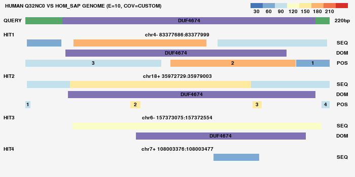

# orthoblast
Orthoblast is a tool that blasts a set of human proteins vs a set of genomes, which are translated, then it counts regions of high homology and compares their numbers across genomes.

Dependencies:
python 3.8.0, 
numpy, 
pandas, 
requests, 
pygame, 
bs4, 
lxml, 
openpyxl, 
biopython 1.74

Usage:        
-p: Proteins. In form of a list, e.g. "amy1 agtr1 bag1" or a path to .xlsx file that has a column labeled "Proteins". This tool will download fastas of specified proteins from uniprot and put them into "proteins" folder        
-s: Species. For species' names please use format: <3_first_letters_of_family_name>_<3_first_letters_of_species_name>. For a bulk run, use a simple list, e.g. "hom_sap het_gla cav_por". Blast databases are stored in "genomes" folder. You can make them manually, or the tool will try to download and install the ones which aren't already in the folder                                      
-e: Evalue for TBLAST (float)                              
-c: Target percent coverage of query by hit to consider homologous (float, < 1). If not specified, program will use internal custom criteria      
-g: Create a graph for every result to review manually (boolean). Default = False (do not create graphs)     
-n: Name for a folder inside "results" in program directory where the output will be stored 

After every run, you can find your results in the folder "results"

